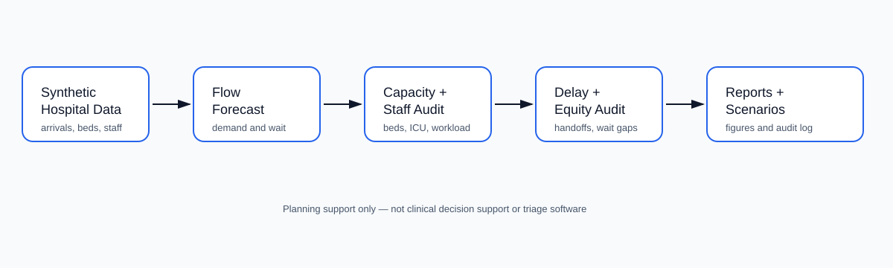

# AI Hospital Operations and Patient Flow Digital Twin

<p align="center"><strong>Independent research-grade synthetic hospital operations and patient-flow digital twin for simulating emergency arrivals, bed capacity, ICU pressure, operating-room bottlenecks, staff workload, ambulance handoff delays, discharge constraints, and fair resource planning.</strong></p>

<p align="center">
  <a href="../../actions/workflows/python-checks.yml"></a>
  <a href="LICENSE"></a>
  
  
</p>

> **Clinical-safety boundary:** this repository uses fictional synthetic arrivals, beds, units, staff rosters, operating-room queues, ambulance handoffs, and discharge states by default. It is independent research and hospital-planning support only. It is not medical advice, triage software, real-time clinical decision support, emergency dispatch, bed-command software, or a replacement for clinicians, nurses, hospital administrators, or licensed operations leaders.

---

## Research objective

Can an AI hospital operations digital twin improve patient-flow planning by forecasting congestion, bed shortages, staff workload, ambulance delays, discharge bottlenecks, and equity risks using synthetic hospital data?

| Research question | Evidence generated locally |
| --- | --- |
| Where is patient-flow pressure highest? | Unit-level demand and queue-pressure forecasts |
| Which beds and care areas are overloaded? | Bed capacity, ICU pressure, and OR backlog audit |
| Where are staffing constraints likely? | Staff workload and patient-to-staff pressure scores |
| Where are ambulance and discharge bottlenecks forming? | Handoff delay and discharge blockage audit |
| Are wait-time burdens uneven across groups? | Synthetic equity and wait-time audit |
| Which operational strategy performs best? | Scenario comparison and KPI summary |
| Can planning runs be reproduced? | JSON summary and hash-chained audit ledger |

---

## Architecture

<p align="center"></p>


---

## Run today — no real patient data needed

```bash
python scripts/run_synthetic_hospital_lab.py
```

Windows quick start:

```bat
cd %USERPROFILE%\ai-hospital-operations-patient-flow-twin
git pull

py -m venv .venv
.venv\Scripts\activate

python -m pip install --upgrade pip
python -m pip install -r requirements.txt
python scripts/run_synthetic_hospital_lab.py
```

Optional larger run:

```bash
python scripts/run_synthetic_hospital_lab.py --arrivals 1200 --units 10 --seed 42
```

Run tests:

```bash
python -m pytest -q
```

---

## Generated local outputs

```text
outputs/results/synthetic_hospital_units.csv
outputs/results/synthetic_bed_inventory.csv
outputs/results/synthetic_staff_roster.csv
outputs/results/synthetic_patient_arrivals.csv
outputs/results/synthetic_operating_room_queue.csv
outputs/results/synthetic_ambulance_handoffs.csv
outputs/results/synthetic_patient_flow_forecast.csv
outputs/results/synthetic_capacity_audit.csv
outputs/results/synthetic_staffing_audit.csv
outputs/results/synthetic_delay_bottleneck_audit.csv
outputs/results/synthetic_equity_waittime_audit.csv
outputs/results/synthetic_scenario_comparison.csv
outputs/results/synthetic_hospital_flow_summary.json
outputs/reports/synthetic_hospital_operations_report.md
outputs/audit/hospital_operations_audit_log.jsonl

outputs/figures/synthetic_arrivals_by_hour.png
outputs/figures/synthetic_capacity_pressure.png
outputs/figures/synthetic_staff_workload.png
outputs/figures/synthetic_delay_bottlenecks.png
outputs/figures/synthetic_equity_waittime_gap.png
outputs/figures/synthetic_scenario_comparison.png
```

---

## Digital twin modules

| Module | Purpose |
| --- | --- |
| Synthetic generator | Builds fictional units, bed inventory, staff rosters, arrivals, OR queues, and ambulance handoffs |
| Flow forecast | Estimates admissions, wait time, bed demand, ICU pressure, and queue pressure |
| Capacity audit | Scores occupancy pressure, ICU saturation, OR backlog, and discharge bottlenecks |
| Staffing audit | Scores workload, patient-to-staff pressure, and coverage gaps |
| Delay audit | Reviews ambulance handoffs, diagnostic waiting, transfer delays, and discharge blockers |
| Equity audit | Flags synthetic wait-time disparities across access, language, age, and arrival-mode groups |
| Scenario analysis | Compares baseline, discharge acceleration, staffing boost, ICU surge, ambulance smoothing, and equity-priority strategies |
| Reporting | Produces Markdown reports, CSVs, JSON summaries, figures, and audit logs |

---

## Independent hospital-planning boundary

This project supports synthetic planning, education, research prototyping, and reproducible operations analysis. Real hospital decisions require validated data pipelines, clinical governance, licensed professionals, privacy controls, incident command, administrative authority, and local policy.

The system should never be used as the sole basis for triage, diagnosis, treatment prioritization, ambulance diversion, bed assignment, discharge decisions, staffing orders, or real-time patient-safety decisions.

---

## Repository map

```text
src/hospitaltwin/
  synthetic.py       # fictional units, beds, staff, arrivals, OR queues, ambulance handoffs
  flow.py            # patient-flow forecasting
  capacity.py        # bed, ICU, OR, and discharge pressure audits
  staffing.py        # staff workload and coverage audit
  delays.py          # ambulance handoff and delay bottleneck audit
  equity.py          # synthetic wait-time equity audit
  scenarios.py       # operating strategy comparison
  audit.py           # hash-chained audit ledger
  visualization.py   # local figures
  reporting.py       # Markdown hospital operations report
scripts/
  run_synthetic_hospital_lab.py
docs/
  methodology.md
  clinical_safety_boundary.md
  synthetic_lab.md
  report_template.md
tests/
  test_synthetic.py
  test_hospital_modules.py
  test_pipeline.py
  test_audit.py
```

---

## Limitations

- Synthetic data validates the pipeline but does not prove real-world hospital performance.
- Operational scores are planning prompts, not clinical decisions.
- Equity metrics are descriptive and require hospital governance interpretation.
- Real use requires privacy review, clinical oversight, validated data, local policy, and field validation.
