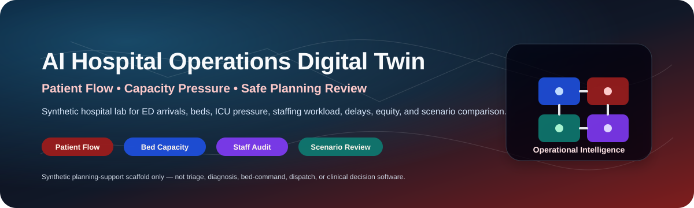
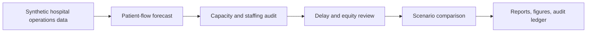
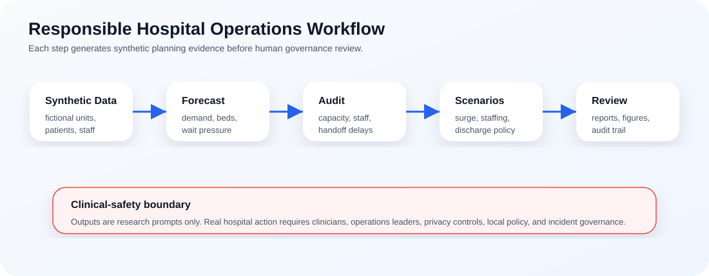

<p align="center">
  
</p>

<h1 align="center">AI Hospital Operations and Patient Flow Digital Twin</h1>

<p align="center">
  <b>A research-grade synthetic hospital operations digital twin for patient-flow forecasting, capacity-pressure review, staffing workload analysis, delay bottleneck auditing, wait-time equity checks, and safe scenario planning.</b>
</p>

<p align="center">
  <a href="../../actions/workflows/python-checks.yml"></a>
  
  
  
  
</p>

---

## Overview

**AI Hospital Operations and Patient Flow Digital Twin** is an independent academic research prototype for studying how synthetic hospital operations data can support safe planning analysis. It simulates fictional emergency arrivals, inpatient units, beds, ICU pressure, operating-room queues, staffing workload, ambulance handoffs, discharge constraints, delay bottlenecks, and wait-time equity signals.

The project is designed around one careful research question: **can a synthetic hospital digital twin help forecast operational pressure and compare planning scenarios while keeping outputs auditable, reproducible, and clearly separated from clinical decision-making?**

It is useful for research and teaching in:

- Hospital operations analytics.
- Patient-flow forecasting and capacity modeling.
- Emergency department and ambulance handoff delay analysis.
- ICU, operating-room, and discharge bottleneck review.
- Staffing workload and coverage-gap analysis.
- Wait-time equity auditing.
- Responsible AI, healthcare governance, and reproducible simulation.

> **Clinical-safety boundary:** this repository uses synthetic data only. It is not medical advice, clinical triage, treatment prioritization, bed-command software, ambulance diversion software, staffing-order software, or real-time clinical decision support.

---

## Research objective

Can a hospital operations digital twin forecast congestion, bed pressure, staffing workload, ambulance delays, discharge bottlenecks, and wait-time equity risks using synthetic hospital data?

| Research question | Evidence generated locally |
|---|---|
| Where is patient-flow pressure highest? | Unit-level demand and queue-pressure forecasts |
| Which care areas are overloaded? | Bed capacity, ICU pressure, and OR backlog audit |
| Where are staffing constraints likely? | Staff workload and patient-to-staff pressure scores |
| Where are ambulance and discharge bottlenecks forming? | Handoff delay and discharge blockage audit |
| Are wait-time burdens uneven across synthetic groups? | Equity and wait-time audit |
| Which operational strategy performs best? | Scenario comparison and KPI summary |
| Can planning runs be reproduced? | CSV outputs, JSON summary, figures, and hash-chained audit ledger |

---

## Architecture

<p align="center">
  
</p>



<p align="center">
  
</p>

The workflow is intentionally transparent. Each output is a synthetic planning prompt, not an automated hospital action.

---

## Core capabilities

| Capability | What it does | Why it matters |
|---|---|---|
| Synthetic hospital generator | Creates fictional units, beds, arrivals, staff rosters, OR queues, ambulance handoffs, and discharge states | Enables experimentation without real patient data |
| Patient-flow forecast | Estimates admissions, queue pressure, waiting time, and bed demand | Helps study operational congestion patterns |
| Capacity audit | Scores occupancy pressure, ICU saturation, OR backlog, and discharge bottlenecks | Makes resource constraints visible |
| Staffing audit | Reviews workload and coverage gaps | Supports safe planning discussions |
| Delay analysis | Reviews ambulance handoffs, diagnostic waiting, transfer delays, and discharge blockers | Surfaces operational bottlenecks |
| Equity audit | Flags synthetic wait-time burden across access, language, age, and arrival-mode groups | Encourages fairness-aware planning |
| Scenario comparison | Compares baseline, discharge acceleration, staffing boost, ICU surge, ambulance smoothing, and equity-priority strategies | Supports transparent what-if analysis |
| Audit trail | Produces reports, figures, CSVs, JSON summaries, and hash-chained logs | Strengthens reproducibility and accountability |

---

## Scenario policies included

| Scenario | Purpose |
|---|---|
| `baseline` | No-intervention synthetic operating state |
| `discharge_acceleration` | Reduces discharge blockers and bed-turnover delay |
| `staffing_boost` | Adds staffing capacity to high-pressure units |
| `icu_surge` | Temporarily increases ICU capacity and transfer handling |
| `ambulance_smoothing` | Reduces ambulance handoff bottlenecks |
| `equity_priority` | Prioritizes reductions in wait-time burden for flagged groups |

---

## Run today — no real patient data needed

```bash
python scripts/run_synthetic_hospital_lab.py
```

Windows quick start:

```bat
cd %USERPROFILE%\ai-hospital-operations-patient-flow-twin
git pull

py -m venv .venv
.venv\Scripts\activate

python -m pip install --upgrade pip
python -m pip install -r requirements.txt
python scripts\run_synthetic_hospital_lab.py
```

Optional larger run:

```bash
python scripts/run_synthetic_hospital_lab.py --arrivals 1200 --units 10 --seed 42
```

Run tests:

```bash
python -m pytest -q
```

---

## Generated local outputs

```text
outputs/results/synthetic_hospital_units.csv
outputs/results/synthetic_bed_inventory.csv
outputs/results/synthetic_staff_roster.csv
outputs/results/synthetic_patient_arrivals.csv
outputs/results/synthetic_operating_room_queue.csv
outputs/results/synthetic_ambulance_handoffs.csv
outputs/results/synthetic_patient_flow_forecast.csv
outputs/results/synthetic_capacity_audit.csv
outputs/results/synthetic_staffing_audit.csv
outputs/results/synthetic_delay_bottleneck_audit.csv
outputs/results/synthetic_equity_waittime_audit.csv
outputs/results/synthetic_scenario_comparison.csv
outputs/results/synthetic_hospital_flow_summary.json
outputs/reports/synthetic_hospital_operations_report.md
outputs/audit/hospital_operations_audit_log.jsonl
outputs/figures/
```

---

## Evaluation metrics

| Metric area | Examples | Boundary |
|---|---|---|
| Flow pressure | arrivals, admissions, queue pressure, waiting time | synthetic operations signal |
| Capacity pressure | occupancy, ICU saturation, OR backlog, discharge blockage | planning prompt only |
| Staffing workload | patient-to-staff pressure, coverage gaps | not a staffing order |
| Delay bottlenecks | ambulance handoff, transfer delay, diagnostic wait, discharge wait | not dispatch guidance |
| Equity review | synthetic wait-time burden across access groups | requires human interpretation |
| Scenario quality | KPI comparison across operating strategies | not hospital policy certification |
| Auditability | reports, figures, CSVs, JSON summaries, audit log | reproducibility evidence |

---

## Responsible hospital-planning boundary

This repository is for research, teaching, and synthetic experimentation. Real hospital operations decisions require validated data pipelines, privacy review, licensed clinical governance, hospital operations leadership, local policy, incident command procedures, patient-safety review, and human oversight.

The system should never be used as the sole basis for triage, diagnosis, treatment prioritization, ambulance diversion, bed assignment, discharge decisions, staffing orders, or real-time patient-safety actions.

---

## Repository map

```text
.
├── assets/
│   ├── banner.svg
│   ├── hospital_flow_architecture.svg
│   └── hospital-workflow.svg
├── docs/
│   ├── governance-and-ethics.md
│   ├── reproducibility-playbook.md
│   └── publication-readiness-plan.md
├── src/hospitaltwin/
│   ├── synthetic.py
│   ├── flow.py
│   ├── capacity.py
│   ├── staffing.py
│   ├── delays.py
│   ├── equity.py
│   ├── scenarios.py
│   ├── audit.py
│   ├── visualization.py
│   └── reporting.py
├── scripts/
│   └── run_synthetic_hospital_lab.py
├── tests/
├── requirements.txt
├── LICENSE
└── README.md
```

---

## Documentation

- [`docs/governance-and-ethics.md`](docs/governance-and-ethics.md): clinical-safety, privacy, equity, and non-deployment boundaries.
- [`docs/reproducibility-playbook.md`](docs/reproducibility-playbook.md): run records, evidence bundles, and interpretation rules.
- [`docs/publication-readiness-plan.md`](docs/publication-readiness-plan.md): academic framing and future research directions.

---

## Future extensions

| Extension | Requirement before claiming results |
|---|---|
| Real hospital operations data | Privacy approval, governance, de-identification, and security controls |
| Discrete-event simulation | Calibrated arrival/service distributions and validation |
| Forecast uncertainty | Prediction intervals and stress testing |
| Real-time dashboards | Clinical governance, fail-safe behavior, monitoring, and rollback plans |
| Equity-aware optimization | Local fairness definitions and stakeholder review |
| Multi-hospital simulation | Data-sharing governance and institution-level comparability checks |

---

## Limitations

- Synthetic data validates pipeline behavior, not real hospital performance.
- Operational scores are planning prompts, not clinical decisions.
- Equity metrics are descriptive and require hospital governance interpretation.
- Scenario results should not be framed as policy recommendations without validation.
- Real use requires privacy review, clinical oversight, validated data, local policy, and field validation.

## License

Released under the [MIT License](LICENSE). Synthetic examples are provided for research and education only.
